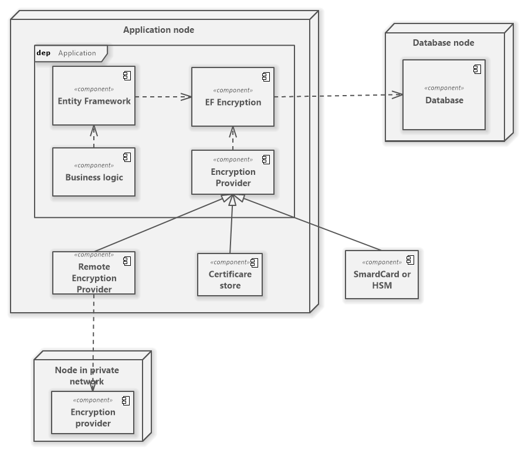
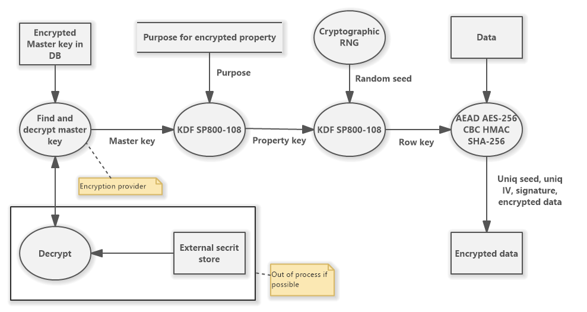

# Harrison314.EntityFrameworkCore.Encryption
[](https://www.nuget.org/packages/Harrison314.EntityFrameworkCore.Encryption/)


Add transparent data encryption to Entity Framework Core inspired [Always Encrypted from MS SQL Server](https://docs.microsoft.com/en-us/sql/relational-databases/security/encryption/always-encrypted-database-engine?view=sql-server-ver15).

_Harrison314.EntityFrameworkCore.Encryption_ is a [Microsoft Entity Framework Core](https://github.com/dotnet/efcore) extension to add support of encrypted fields using built-in or custom encryption providers.

## Features
* Database agnostic (tested on Sqlite, MS SQL Server, PostgreSQL, Azure CosmosDB).
* Key rotation.
* Simple for use.
* Deterministic or randomized encryption.
* Build using standard cryptographic algorithms (AES, HMAC SHA2, SP800-108, PBKDF-2,...).
* Internal or external (out of process or on another server e.c. Azure Key Valut) encryption providers.
* Encryption providers:
  * Password (only for testyng),
  * Ceratiricate (Recomandedt use with Windows store with non exportable private keys or SmartCard.),
  * PKCS11 data objects (in contrib library),
  * Azure Key Valut (in samples), **Work in progress**
  * Remote provider (in contrib library),
  * Custom provider (custom implementation of `IDbContextEncryptedCryptoProvider`).

## High-level application architecture



## Cryptography
The following dataflow diagram shows the encryption and derivation of the key for a record property.



## How to use

### Sample data model
Original data model:

```cs
 public class Patient
{
    public int Id { get; set; }
    public string FirstName { get; set; }
    public string LastName { get; set; }
    public string SocialSecurityNumber { get; set; }
    public string OtherId { get; set; }
    public bool Alert { get; set; }
    public string Notes { get; set; }
    public virtual ICollection<Visist> Visists { get; set; }
}

public class Visist
{
    public int Id { get; set; }
    public DateTime Date { get; set; }
    public string Note { get; set; }
    // and other
}

public class SampleDbContext : DbContext
{
    public DbSet<Patient> Patients
    {
        get;
        set;
    }

    public DbSet<Visist> Visits
    {
        get;
        set;
    }

    public SampleDbContext(DbContextOptions options)
        : base(options)
    {
    }

    protected override void OnModelCreating(ModelBuilder modelBuilder)
    {
        modelBuilder.Entity<Patient>(p =>
        {
            p.HasKey(t => t.Id);
            p.Property(t => t.FirstName).IsRequired().HasMaxLength(150);
            p.Property(t => t.LastName).IsRequired().HasMaxLength(150);
            p.Property(t => t.SocialSecurityNumber).IsRequired().HasMaxLength(150);
            p.Property(t => t.Notes).HasDefaultValue(string.Empty);
            p.HasMany(t => t.Visists).WithOne(t => t.Patient).HasForeignKey(t => t.PatientId);
        });

        modelBuilder.Entity<Visist>(p =>
        {
            p.HasKey(t => t.Id);
        });
    }
}
```
### 1. Install nuget package

Run in project folder:  
```
dotnet add package Harrison314.EntityFrameworkCore.Encryption
```

### 2. Register encryption services to DI

In `Startup.cs` register _DbContext_ and _Encryption Context_ for _DbContext_:
```cs
public void ConfigureServices(IServiceCollection services)
{
    services.AddDbContext<SampleDbContext>(builder =>
    {
        builder.UseSqlServer(this.Configuration.GetConnectionString("PrimaryDb"));
    });

    services.AddEncryptedContext<SampleDbContext>()
        .WithPasswordEncryptionProvider("Passw0rd*"); // Password provider is only for testing, use other provider
}
```
### 3. Update DbContext
Insert `AddEncryptionContext` to `ModelBuilder` and mark encrypted properies with purpose, algorithm and mode.

* _purpose_ - must by uniq string for property in context. Do not change after deploy to production!
* _algorithm_ - chiper and AEAD algorithm.
* _mode_ - Deterministic or randomized.
* _compressionMode_ - Compression mode for compression plaintext data.

```cs
public class SampleDbContext : DbContext
{
    public DbSet<Patient> Patients
    {
        get;
        set;
    }

    public DbSet<Visist> Visits
    {
        get;
        set;
    }

    public SampleDbContext(DbContextOptions options)
        : base(options)
    {
    }

    protected override void OnModelCreating(ModelBuilder modelBuilder)
    {
        modelBuilder.AddEncryptionContext();

        modelBuilder.Entity<Patient>(p =>
        {
            p.HasKey(t => t.Id);
            p.Property(t => t.FirstName)
              .HasEncrypted("Patient.FirstName", 
                  EncrypetionType.AEAD_AES_256_CBC_HMAC_SHA_256,
                  EncryptionMode.Randomized,
                  CompressionMode.None)
              .IsRequired().HasMaxLength(150);
            p.Property(t => t.LastName)
              .HasEncrypted("Patient.LastName",
                  EncrypetionType.AEAD_AES_256_CBC_HMAC_SHA_256,
                  EncryptionMode.Randomized,
                  CompressionMode.None)
              .IsRequired().HasMaxLength(150);
            p.Property(t => t.SocialSecurityNumber)
              .HasEncrypted("Patient.SocialSecurityNumber",
                  EncrypetionType.AEAD_AES_256_CBC_HMAC_SHA_256,
                  EncryptionMode.Deterministic,
                  CompressionMode.None)
              .IsRequired().HasMaxLength(150);
            p.Property(t => t.Notes).HasDefaultValue(string.Empty);
            p.HasMany(t => t.Visists).WithOne(t => t.Patient).HasForeignKey(t => t.PatientId);
        });

        modelBuilder.Entity<Visist>(p =>
        {
            p.HasKey(t => t.Id);
        });
    }
}
```
### 3. Work with sensitive data

Only in _encrypted scope_ is poosible working with encrypted properties.

```cs
public class PatientController : Controller
{
    private readonly SampleDbContext context;
    private readonly IDbContextEncryptedProvider<SampleDbContext> encryptionProvider;

    public PatientController(SampleDbContext context, IDbContextEncryptedProvider<SampleDbContext> encryptionProvider)
    {
        this.context = context;
        this.encryptionProvider = encryptionProvider;
    }

    [HttpGet(Name = "GetAllPatients")]
    [ProducesResponseType(typeof(List<PatientInfo>), 200)]
    public async Task<IActionResult> GetAll()
    {
        IEncryptedScopeCreator scopeProvider = await this.encryptionProvider.EnshureEncrypted();
        using IDisposable encryptedScope = scopeProvider.IntoScope();

        List<PatientInfo> result = await this.context.Patients.OrderBy(t => t.Id).Select(t => new PatientInfo()
        {
            FirstName = t.FirstName,
            Id = t.Id,
            LastName = t.LastName
        })
        .ToListAsync();

        return this.Ok(result);
    }
}
```

Find records by encrypted property:
```cs
IEncryptedScopeCreator scopeProvider = await this.encryptionProvider.EnshureEncrypted();
using IDisposable encryptedScope = scopeProvider.IntoScope();

Patient patient = await this.context.Patients.Where(t => t.SocialSecurityNumber == ssn).SingleOrDefaultAsync();
```

Update non-encrypted column without encrypt and decrypt:
```cs
using IDisposable defaultValuesScope = this.encryptionProvider.EnshureDefaultValues().IntoScope();

Patient patient = await this.context.Patients.FindAsync(id);
patient.Notes = model.Notes ?? string.Empty;
await this.context.SaveChangesAsync();
```

## Other software

1. [Software Ideas Modeler](https://www.softwareideas.net/)
